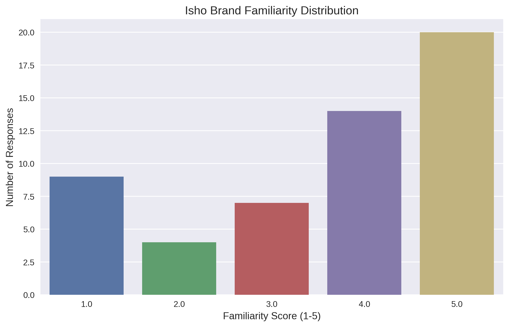

# Bangladesh Furniture Market Analysis: Isho Brand Study

A comprehensive market research analysis of furniture preferences and brand perceptions in Bangladesh, with a special focus on the Isho brand. This study reveals crucial insights into consumer behavior, brand positioning, and market opportunities in the growing furniture sector of Bangladesh.

## 📋 Data Overview

This analysis is based on extensive survey data covering:
- Consumer furniture preferences and shopping behaviors
- Brand perceptions and awareness metrics
- Detailed demographic information
- Purchase patterns and decision factors

### Data Processing
The raw survey data underwent rigorous preprocessing:
- Standardization of column names and text responses
- Conversion of categorical data to numeric features
- Treatment of missing values
- Processing of multiple-choice responses
- Creation of derived metrics for:
  - Age group categorization
  - Income range normalization
  - Brand familiarity scoring
  - Customer recommendation metrics

## 📊 Key Findings

### Demographics Overview
Our analysis reveals a predominantly young, professionally active consumer base:
- **Age Distribution**: Strong concentration of young professionals (51.9% aged 25-34), indicating a prime market for modern furniture designs
- **Gender Split**: Well-balanced representation (57.4% Male, 42.6% Female), suggesting gender-neutral marketing approaches
- **Professional Background**: Dominated by private sector (33.3%) and self-employed (20.4%) individuals, indicating a sophisticated consumer base
- **Income Levels**: Significant middle-income representation (74% in BDT 25,000-50,000 range), crucial for pricing strategy

  
  

Our occupation analysis reveals an interesting mix of traditional and emerging professional categories:

  
  

#### Demographic Cross-Analysis
The correlation between age and income (r = 0.309, p = 0.023) suggests a significant relationship between career progression and purchasing power:

  

### Consumer Preferences

#### Furniture Style Preferences
Our analysis reveals a clear shift towards contemporary aesthetics:
- Modern designs dominate with 44.4% preference, reflecting urban lifestyle trends
- Minimalist styles (24.1%) show growing appreciation for simplified aesthetics
- Traditional designs (16.7%) maintain a significant niche market

  

#### Purchase Decision Factors & Room Priorities
Key decision factors reflect a value-conscious market:
- Quality and durability lead at 38.9%
- Price sensitivity ranks second at 29.6%
- Design aesthetics influence 16.7% of decisions

Living/Drawing Room emerges as the top priority (53.7%), followed by Bedroom (35.2%):

  
  

#### Shopping Behavior
Consumer channel preferences show strong traditional retail influence:
- In-store shopping dominates (59.3%), highlighting the importance of physical showrooms
- Omnichannel presence is growing (31.5% use both online and offline)
- Seasonal peaks observed during mid-year (29.6%) and year-start (27.8%)

  

### Isho Brand Analysis

#### Brand Awareness & Perception
Strong brand recognition metrics:
- 62.9% high familiarity (rated 4-5 out of 5)
- 59.3% report positive word-of-mouth
- Strong association with modern design and quality

  
  

#### Brand Associations & Customer Feedback
Key brand perceptions:
- Modern and high-quality positioning resonates strongly
- Price sensitivity emerges as primary purchase barrier
- Strong positive associations among buyers

  
  

## 🔍 Advanced Statistical Analysis

### Correlation Analysis
Statistical significance found in key relationships:
- Age-Income correlation (r = 0.309, p = 0.023)
- Brand familiarity-recommendation correlation (r = 0.196)

  
  

### Statistical Modeling
Income distribution shows positive skewness (2.067), indicating opportunity in premium segments:

  
  

### Advanced Analytics
Bootstrap analysis confirms reliability of findings:
- Mean recommendation score: 1.57
- 95% Confidence Interval: [1.02, 2.15]

  
  
  

## 💡 Key Insights & Recommendations

1. **Market Opportunity**
   - Target young professionals in the 25-34 age bracket
   - Focus on modern and minimalist design offerings
   - Optimize price points for the dominant middle-income segment
   - Leverage the strong preference for living room furniture

2. **Brand Strategy**
   - Build on existing positive brand perception
   - Address price sensitivity through value communication
   - Expand brand awareness among non-users
   - Emphasize quality and durability in marketing

3. **Channel Strategy**
   - Prioritize showroom experience
   - Develop integrated online presence
   - Plan promotions around identified seasonal peaks
   - Enhance after-sales service

## 🛠 Technical Details

### Tools & Technologies
- Python 3.8+
- Advanced data analysis libraries (pandas, numpy, scipy)
- Statistical modeling (scikit-learn)
- Data visualization (matplotlib, seaborn)

### Analysis Components
- Demographic segmentation
- Preference analysis
- Brand perception mapping
- Statistical significance testing
- Advanced correlation analysis

## 📈 Project Impact

This analysis provides actionable insights for:
- Market positioning strategies
- Product development decisions
- Pricing strategy optimization
- Marketing campaign targeting
- Customer experience enhancement

## 📝 License

This project is licensed under the MIT License - see the LICENSE file for details.

---
*This analysis was conducted as part of a market research project demonstrating advanced analytical capabilities in consumer behavior analysis and brand perception studies. The findings combine statistical rigor with practical business insights to deliver actionable recommendations for furniture market stakeholders.*

